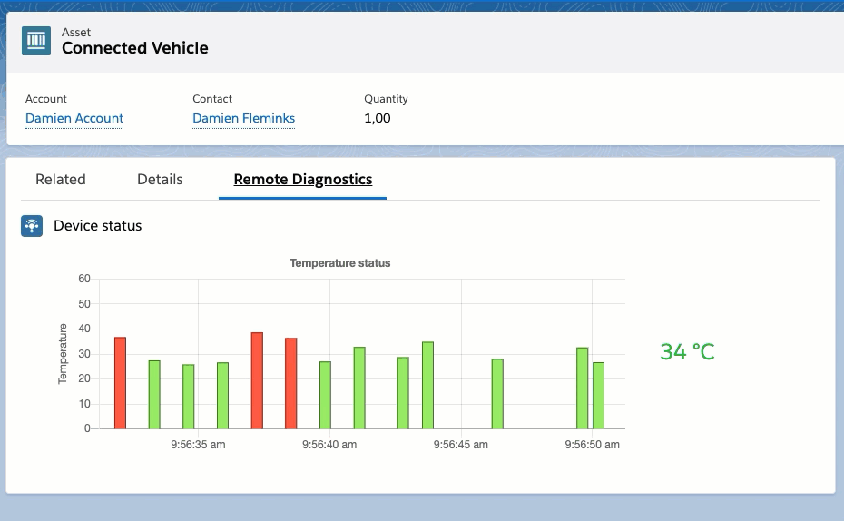

# SFDX App

IoT Streaming chart 

## Resources

- EmpApi:   https://developer.salesforce.com/docs/component-library/bundle/lightning-emp-api/documentation
- Chart.js: https://www.chartjs.org/
- Streaming Chart.js plugin:  https://github.com/nagix/chartjs-plugin-streaming
- Electric Imp setup guide:  https://github.com/electricimp/Salesforce/tree/master/examples/OAuth2_SmartRefrigerator

## Description of Files and Directories

- Built in Lightning Web components using EmpApi to subscribe to platform events
- Displays the streaming events through a lightning web compponent using the chart.js library
- Includes a process builder flow which created a case if the platform event value is too high

<b>Process Builer Flow: </b>

<b> The lightning web component is configurable: </b>

- Platform event and attribute to track can be set
- Tick the "Use fake data" checkbox to test with fake data stream

